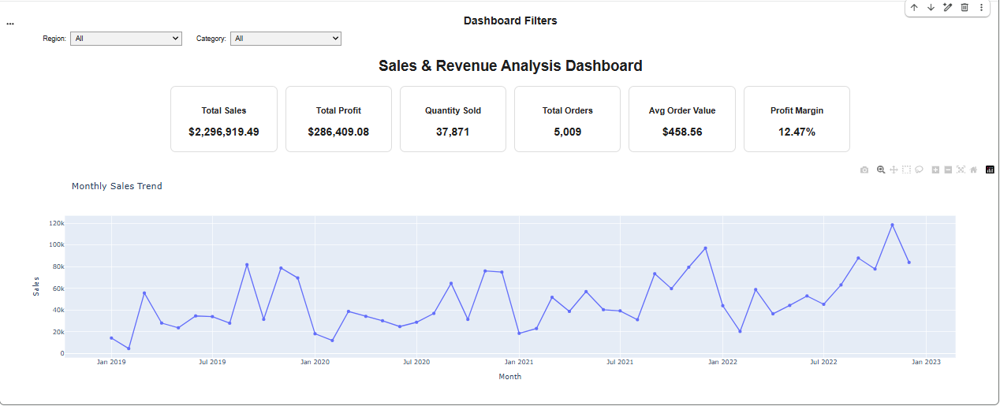

# 📊 Sales & Revenue Analysis Dashboard

An interactive data analytics dashboard built with Python to analyze sales, revenue, profitability, product performance, and regional trends.

## 🚀 Project Overview 

This project analyzes sales transaction data to identify key business performance indicators and generate actionable insights through interactive visualizations.

The dashboard enables users to explore business performance using dynamic Region and Category filters.

## 📌 Key KPIs

| KPI | Value |
|---|---:|
| Total Sales | $2,296,919.49 |
| Total Profit | $286,409.08 |
| Quantity Sold | 37,871 |
| Total Orders | 5,009 |
| Average Order Value | $458.56 |
| Profit Margin | 12.47% |

## 📈 Dashboard Features

- Monthly Sales Trend
- Monthly Profit Trend
- Sales by Category
- Profit by Region
- Top 10 Products by Sales
- Interactive Region Filter
- Interactive Category Filter
- KPI tracking

## 💡 Business Insights

1. Technology is the highest-performing category in terms of both sales and profit.
2. West is the leading region by total sales.
3. Canon imageCLASS 2200 Advanced Copier is the top-performing product by sales.
4. Monthly sales trends help identify changes in business performance over time.
5. Comparing sales and profit provides a better understanding of overall business performance.
6. Region and Category filters allow users to interactively analyze specific parts of the dataset.

## 🛠️ Tech Stack

- Python
- Pandas
- Plotly
- IPyWidgets
- Google Colab
- Kaggle Dataset

## 📂 Project Files

| File | Description |
|---|---|
| `Sales_Revenue_Analysis_Dashboard.ipynb` | Complete data analysis and interactive dashboard |
| `sales_data .csv` | Dataset used for the analysis |
| `dashboard.png` | Dashboard preview |

## 🎯 Skills Demonstrated

Data Cleaning • Exploratory Data Analysis • KPI Development • Data Visualization • Interactive Dashboards • Business Insights • Python

## 📷 Dashboard Preview

## 📌 Conclusion

The Sales & Revenue Analysis Dashboard provides an interactive overview of sales, profit, products, categories, and regional performance. The project demonstrates practical skills in data cleaning, KPI calculation, data analysis, visualization, and interactive dashboard development using Python.
